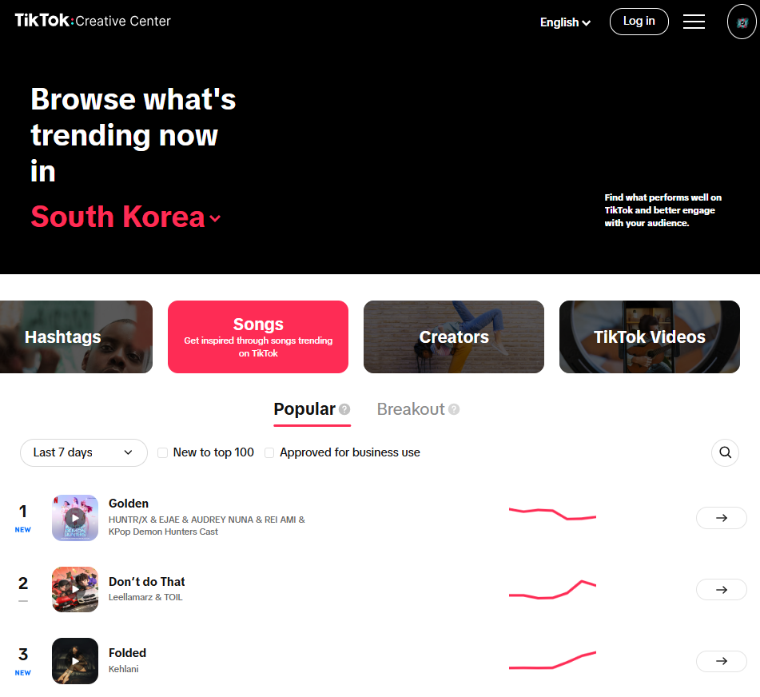
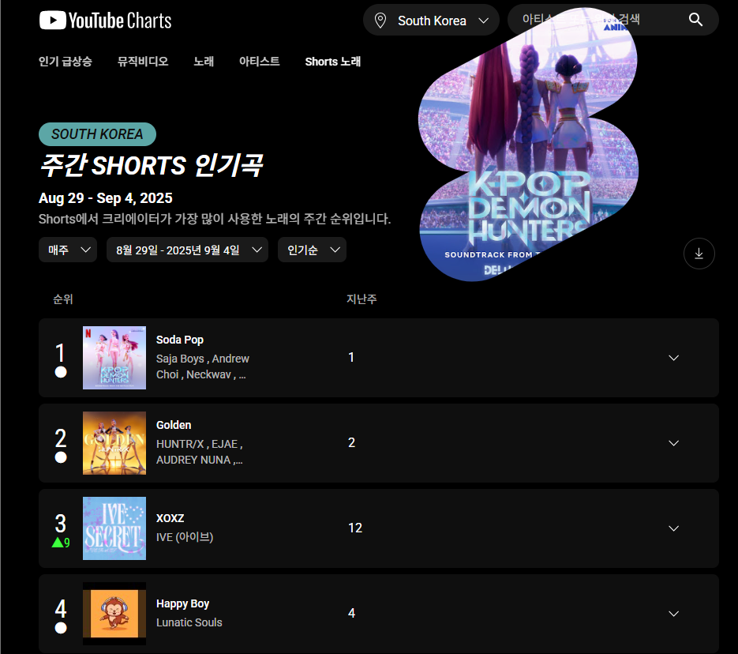
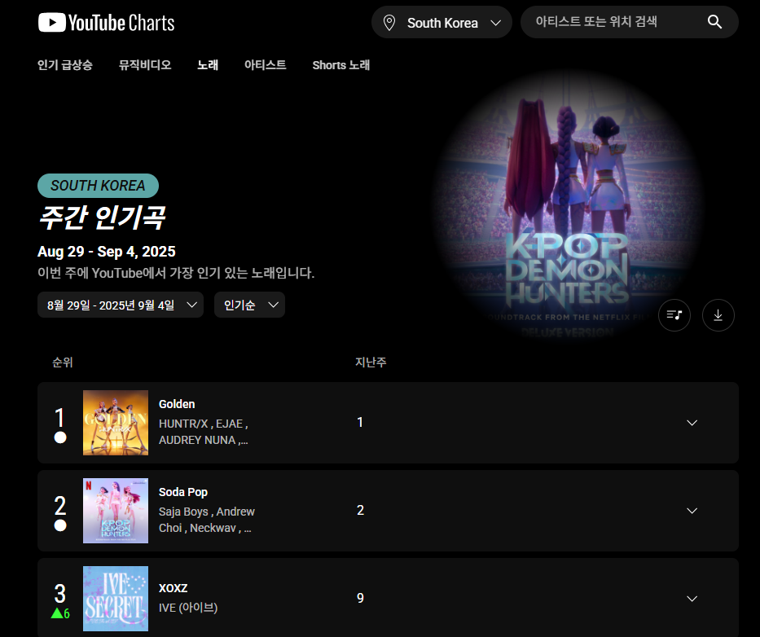
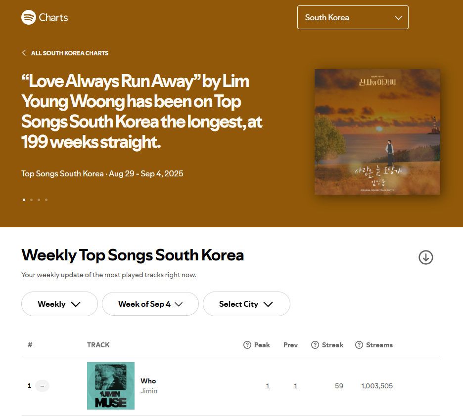

# 📌 개요

## 숏폼 콘텐츠의 확산
- 숏폼 : [압축적으로 정보를 전달하는 짧은 호흡의 콘텐츠](https://www.kbanker.co.kr/news/articleView.html?idxno=220975)
- 15초~10분 이내의 동영상으로, 스마트폰으로 쉽게 즐길 수 있도록 세로형 동영상이 많음
- 유튜브 쇼츠(YouTube Shorts), 인스타그램 릴스(Instagram Reels), 틱톡(TikTok) 등
  - 15초 내외의 짧은 동영상을 제작하고 공유하는 소셜미디어 플랫폼 ['틱톡(TikTok)'이 Z세대 중심으로 인기를 끌며 숏폼(Short-Form) 콘텐츠가 대세가 되었음](https://brunch.co.kr/@mobiinside/3308)
- 짧은 시간에 빠른 정보를 얻는 걸 선호하는 MZ 세대를 중심으로 새로운 인터넷 문화로 자리잡으며 모든 연령대로 그 소비층이 확대되고 있음
- [데이터 수집 플랫폼 스태티스타(Statista) 조사 결과](https://www.itbiznews.com/news/articleView.html?idxno=156675)
  - 2024년 유튜브 쇼츠 월간활성유저(MAU)는 평균 20억 명 이상 (월간 유튜브 전체 이용자 수가 25억명인 것을 감안하면 쇼츠의 점유율은 3/4을 넘어서는 수치)
  - 2024년 인스타그램 MAU 20억 명 돌파
  - 틱톡 소비자 지출 기준으로 2021년 10억 달러를 처음 넘어선 이래 2022년 33억 달러, 2023년 38억 달러

## 전통적인 소셜미디어와의 차이
- 기존의 팔로우 관계보다는 인공지능 추천에 기반
  - 소셜미디어에서 소셜과 미디어를 분리하고 있으며, 미디어 엔터테인먼트에서 미디어의 성격을 강화
  - 소셜 그래프 방식(친구 기반, 팔로잉 기반, 구독 기반)의 콘텐츠 소비에서 인공지능이 추천하는 콘텐츠를 소비하는 콘텐츠 그래프 방식으로 변화
- 참여 방식에 변화
  - 댓글로 자신의 반응을 전달하는 기존의 방식
  - 또 다른 숏폼 동영상으로 자신의 반응을 담아내는 이용자가 증가
  - 틱톡의 성공 요소 중 하나는 '이어찍기'와 '듀엣'

## 숏폼 콘텐츠와 음악 산업
- 음악 산업에 끼친 영향
  - 숏폼 컨텐츠는 특히 음악 산업 분야에 아주 큰 변화를 일으키고 있음
  - Z세대를 중심으로 '댄스 챌린지'라는 새로운 문화를 이끌어내고 있음
- [뉴요커](https://www.newyorker.com/magazine/2022/12/12/so-you-want-to-be-a-tiktok-star) (2022.12)
  - [틱톡으로 인해 음악 비즈니스의 작동 방식이 변화하고 있다고 분석](https://www.kca.kr/Media_Issue_Trend/vol60/KCA60_23_trend.html)
  - 캐서린 리(Katherine Li) 등 틱톡을 통해 실제 스타로 성장한 수많은 사례 존재
  - 틱톡의 인기 배경 음악과 스포티파이 인기곡 사이 강력한 상관관계가 존재
- [복스(Vox)]
  - 음악 콘서트를 즐기는 방식이 틱톡 덕분에 크게 변화했다고 분석

## 바이럴 수단으로의 숏폼 콘텐츠
- 릴 나스 엑스(Lil Nas X) - Old Town Road
  - 바이럴 마케팅을 통해 1994년 이후 한 번도 깨지지 않았던 빌보드 'HOT 100' 연속 1위 기록을 갱신
- 지코(ZICO) - 아무노래
  - '아무노래 챌린지'를 유행시키며 음원차트 역주행, 그 해 멜론 연간 차트 1위를 기록

# 📌 데이터 선정

## 숏폼 컨텐츠의 인기 음원 데이터
- **유튜브 쇼츠(YouTube Shorts)**
  - [Youtube Charts](https://charts.youtube.com/charts/TopShortsSongs/kr/weekly)
  - 노래를 사용해 만든 Shorts 동영상의 총 개수를 기준 (출처: [YouTube 고객센터](https://support.google.com/youtube/answer/9014376?hl=ko#zippy=%2C%EC%A3%BC%EA%B0%84-shorts-%EC%9D%B8%EA%B8%B0%EA%B3%A1%2C%EC%9D%BC%EA%B0%84-shorts-%EC%9D%B8%EA%B8%B0%EA%B3%A1))
  - 국가 or 글로벌 선택 / 기간 선택 필수 (매일, 매주)
    - 날짜를 선택해 특정 과거의 일간/주간 데이터 조회 가능
  - 카테고리 선택
    - 인기순 : 틱톡의 Popular 와 유사
    - 인기 급상승 곡 : 틱톡의 Breakout 과 유사
    - 가장 인기 있는 신곡
- **틱톡(TikTok)**
  - [TikTok Creative Center](https://ads.tiktok.com/business/creativecenter/inspiration/popular/music/pc/en)
  - 국가 선택 필수 / 기간 선택 필수 (7일, 30일, 120일)
  - 카테고리 선택
    - Popular : 선택 지역 및 기간 내에서 가장 인기 있는 노래 순위 목록
    - Breakout : 선택 지역 및 기간 내에 빠른 속도로 성장하고 있는 노래 순위 목록
- **인스타그램 릴스(Instagram Reels)** -> 수집 대상에서 제외
  - PC 버전에서는 릴스 탐색 기능이 거의 제한적, 인기 음원 목록은 앱 내에서만 탐색 가능
  - 공식 API로도 릴스 데이터에는 접근 불가

<div style="width=100%; display: flex; justify-content: center;">
    
    
</div>

### 🔻 추출 대상
- **미국**과 **한국**의 **120일 간**의 **인기순(Popular)**, **인기 급상승(Breakout)** 데이터
- 데이터가 더 적은 틱톡을 기준으로 추출 대상을 정함
  - 틱톡의 South Korea 인기 음원 데이터 추출 조건으로 7일 선택 시 10개 내외, 30일 선택 시 30개 내외 -> 데이터 수 부족
  - 120일 기준으로 추출 시 100건 존재
- 유튜브는 인기/인기 급상승 주간 데이터만 존재함
  - 인기 데이터는 50위, 인기 급상승 데이터는 50개 미만 존재함
  - 120일에 맞추어 Youtube의 주간 데이터를 17주에 걸쳐 수집 (119일)
  - 곡별 점수를 계산하여 TikTok과 같은 1~100위 통합 순위를 생성
    - `최종 점수 = 0.8 * 점수 + 0.2 * 최장 차트 지속 기간`
    - `점수 = 51 - 순위`
- 쇼츠의 음원 데이터만 추출할 경우, 특정 기간 동안의 데이터를 모두 가져올 수 있을 것
  - ex) 2024년 한 해 동안의 월간 데이터를 추출해 트렌드 분석 가능

## 음원 성과 데이터
- **유튜브(YouTube)**
  - [Youtube Charts](https://charts.youtube.com/charts/TopSongs/kr/weekly)
    - 성과는 조회수를 기준으로 함
    - 주간 인기곡 표시 기준 : YouTube에서 가장 많이 재생된 노래 (출처 : [YouTube 고객센터](https://support.google.com/youtube/answer/9014376?hl=ko#zippy=%2C%EC%A3%BC%EA%B0%84-%EC%9D%B8%EA%B8%B0%EA%B3%A1))
    - 조회수 집계 방법 : 공식 버전에서 발생한 총 조회수를 합산
  - 국가 or 글로벌 선택 / 주간 데이터
    - 날짜를 선택해 특정 과거의 주간 데이터 조회 가능
  - 한 주당 100개의 데이터
- **스포티파이(Spotify)**
  - [Spotify](https://charts.spotify.com/charts/view/regional-kr-weekly/2025-09-04)
    - 성과는 스트리밍 수를 기준으로 함
    - 주간 인기곡 표시 기준 : 특정 도시의 스트리밍 인기도를 반영 (출처 : [Spotify](https://support.spotify.com/kr-ko/artists/article/charts/))
    - 스트리밍 횟수 집계 방법 : 30초 또는 그 이상 청취한 경우 스트리밍 횟수로 집계 (출처 : [Spotify](https://support.spotify.com/kr-ko/artists/article/how-we-count-streams/))
  - 국가 or 글로벌 선택 / 주간 데이터
    - 날짜를 선택해 특정 과거의 주간 데이터 조회 가능
  - 한 주당 200개의 데이터

<div style="width=100%; display: flex; justify-content: center;">
    
    
</div>

### 🔻 추출 대상
- 동일 기간의 데이터를 가져오기 위해 120일에 맞추어 주간 데이터를 17주에 걸쳐 수집 (119일)
  - 최장 차트 지속 기간, 평균 순위, 최고 순위, 최저 순위, 120일간 조회수 or 스트리밍수
- 곡별 점수를 계산하여 통합 순위를 생성
  - 숏폼 인기 음원 데이터와 다르게 성과 데이터이므로 조회수와 스트리밍수가 중요
  - `최종 점수 = 0.2 * 점수 + 0.2 * 최장 차트 지속 기간 + 0.6 * (조회수 or 스트리밍수)`
  - `점수 = 51 - 순위`
  
# 📌 데이터 수집

## 웹 크롤링
- 인기 음원 데이터와 음원 성과 데이터를 추출
- 도구
  - **Selenium** : 웹 브라우저를 이용하여 웹 사이트에서 자동적으로 제어할 수 있게 함
  - **BeautifulSoup** : html과 xml 문서를 parsing하기 위한 패키지로 html에서 데이터를 추출하는 데 사용

# 📌 전처리

## 데이터 정제
- 데이터셋이 누락되거나, 부정확하거나, 중복되거나, 이상값을 포함한 경우 이를 수정 또는 제거하는 과정
- 도구 : **Pandas**, **Numpy**
- 결측치/이상치 처리
- 중복 데이터 제거 : 곡명/아티스트명의 중복 항목 제거
- 비일관성 해결 (ex. 'striped' 가 곡 명 뒤에 붙었다고 해서 두 곡이 다른 곡으로 인식되면 안됨)
  - striped : 곡에 꼭 필요한 요소만 넣어 연주하는 것을 의미

## 데이터 포맷
- 일간/주간 단위 데이터의 날짜 포맷을 datetime 형식으로 통일

## 데이터 통합
- 공통 키 매핑 : `곡 제목 + '_' + 아티스트`
- 플랫폼마다 아티스트 표기가 다를 수 있어 정규화 또는 Fuzzy Matching 필요할 수 있음

### 🔻 Fuzzy Matching(퍼지 매칭)
- 텍스트나 문자열이 정확히 일치하지 않아도 유사한 정도를 비교하여 매칭하는 방법
  - `'Rosé', 'Rose', 'ROSE', '로제'` 등이 비슷한 대상임을 파악하는 기술
- 사용
  - 크롤링된 가수 이름이나 곡 제목이 표기법이 다르거나 오타가 있을 때
  - 서로 다른 플랫폼에서 아티스트/곡을 정규화 없이 비교해야 할 때
  - 사용자 입력값과 DB의 항목이 정확히 일치하지 않는 경우에도 검색되게 하고 싶을 때
- 작동 방식
  - **레벤슈타인 거리(Levenshtein Distance)** : 두 문자열을 일치시키기 위해 필요한 삽입/삭제/변경 횟수로 유사도를 측정
  - `예: "rose" → "rosé" = 1회 변경 → 매우 유사`
``` python 
from fuzzywuzzy import fuzz

fuzz.ratio("Rose", "ROSÉ")  # 75~80 정도
fuzz.token_sort_ratio("Black Pink", "BLACKPINK")  # 90 이상
```

# 📌 데이터 분석

# 📌 시각화

# 📌 결론


